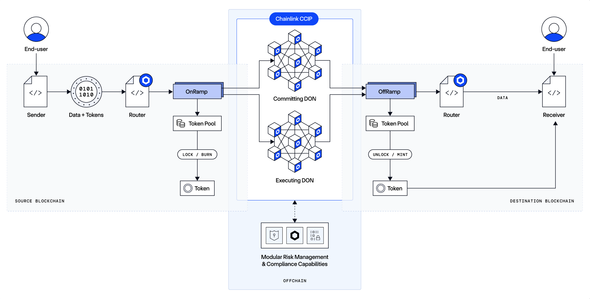
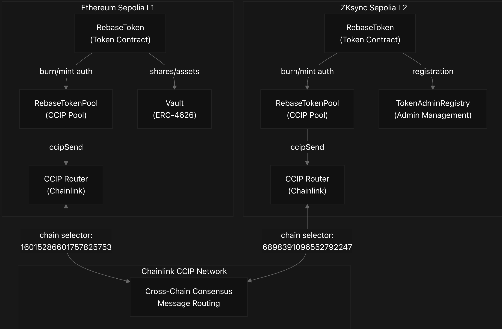

# Cross-Chain Rebase Token

The Rebase Token project is a cross-chain DeFi system that enables interest-bearing tokens with preserved rates across multiple blockchains. The architecture consists of four main components working together through Chainlink's CCIP protocol.

 

## 1. RebaseToken Contract

The core token implements a rebase mechanism where each user has an individual interest rate locked in at deposit time.

`Key Features`:

`Interest Accrual`: Users earn interest based on their locked-in rate

`Individual Rates`: Each user gets the global rate at their first deposit

`Rate Decreases Only`: Global interest rate can only decrease to protect early users

`Cross-Chain Support`: Special functions for preserving rates during bridges

The balanceOf() function calculates real-time balances including accrued interest:

## 2. Vault Contract

Handles single-chain ETH deposits and withdrawals, minting/burning RebaseTokens accordingly.

       Deposit Flow:

       User sends ETH to deposit()
       Vault calls token.mint(user, amount)
       User receives RebaseTokens with locked-in interest rate

       Withdrawal Flow:

       User calls redeem(amount)
       Vault calls token.burn(user, amount)
       User receives equivalent ETH back

## 3. RebaseTokenPool (Cross-Chain Bridge)

Extends Chainlink's TokenPool to enable cross-chain transfers while preserving user interest rates.

## Outbound Transfer (lockOrBurn)

When tokens leave a chain: 

01. Fetch user's current interest rate
02. Burn tokens from pool
03. Encode interest rate in CCIP message
04. Send to destination chain

## Inbound Transfer (releaseOrMint)

When tokens arrive on destination: RebaseTokenPool.

01. Decode interest rate from message
02. Mint tokens to receiver with preserved rate
03. User maintains their original interest accumulation

## 4. Multi-Chain Deployment

The system deploys identical contracts across chains with specific CCIP configurations:

`ZKsync Sepolia Deployment`

Uses --legacy --zksync flags for compatibility
Specific CCIP addresses for ZKsync network bridgeToZksync.
Permission setup via registry contracts bridgeToZksync.

`Ethereum Sepolia Deployment`

Uses standard Foundry scripts
Network details retrieved from Chainlink registry Deployer.

  

## 5. Cross-Chain Configuration

Pools are configured for bidirectional communication using applyChainUpdates():

Each pool stores:

       Remote chain selectors
       Remote pool addresses
       Remote token addresses
       Rate limiter configurations

## Data Flow Example

User deposits `1 ETH` into Vault on `Ethereum Sepolia`

`Receives` 1 RebaseToken with `5% interest` rate locked.

After `1 hour`, token balance shows `1.00018` (interest accrued)

User bridges 0.5 tokens to `ZKsync`

Interest rate (5%) travels in `CCIP message`.

User `receives` 0.5 tokens on ZKsync with `same 5% rate`.

Interest continues accruing on both chains independently

## Security Architecture

`Permission Model`:

`MINT_AND_BURN_ROLE` granted only to Vault and Pools RebaseToken.

`TokenAdminRegistry` authorizes pools for `CCIP`

Only registered CCIP routers can call pool functions

`Rate Protection`:

Global interest rate can only decrease

User rates locked at first deposit

Cross-chain transfers preserve individual rates

## Resources:-

https://blog.blockmagnates.com/erc-4626-the-vault-token-standard-explained-afbf95e9962c

https://deepwiki.com/pranaykargam/Rebase-Token/1-home

